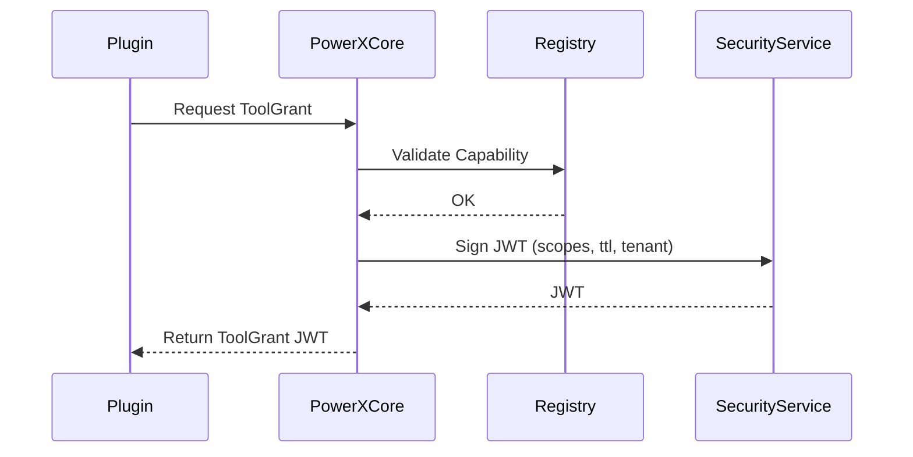

# 工具作用域与授权矩阵规范（05_protocols_and_integrations/ToolScopes_and_GrantMatrix.md）

> 本文档定义 PowerX 插件在多协议运行环境（HTTP/gRPC/MCP/A2A）下的统一授权机制，  
> 即 **ToolGrant 模型（Tool Grant Token）** 与 **Scope 权限矩阵（Scope Matrix）**。  
> 它描述了插件或 Agent 如何获得、使用、更新与吊销访问特定能力（Capability）的权限。

---

## 🧭 一、设计目标

- 实现 **统一的跨协议授权模型**，适用于所有调用路径（HTTP、gRPC、MCP、A2A）；  
- 确保授权遵循“**最小权限原则**（Least Privilege）”；  
- 支持 **租户级隔离** 与 **Agent/插件级细分**；  
- 支持 **可观察、可审计、可吊销** 的权限生命周期管理；  
- 与 Marketplace 的 License / Billing 模型兼容。

---

## 🧱 二、核心概念与关系

| 概念 | 说明 |
|------|------|
| **Capability** | 插件暴露的一个可调用能力，如 `crm.contact.create` |
| **Scope** | 一组能力的授权边界集合，如 `crm.*` 或 `ai.email.send` |
| **ToolGrant** | 授权令牌，用于表示谁（Agent/插件）被授予调用哪些能力的权限 |
| **Subject** | 请求发起者（可为 Plugin、Agent、Tenant User） |
| **Context** | 调用上下文（租户、会话、trace） |
| **TTL** | 有效期，防止长期滥用 |
| **Audit** | 授权、使用、吊销的记录流转机制 |

---

## 🧩 三、ToolGrant 模型结构

```json
{
  "grant_id": "tg_01HDS2XE...",
  "issued_to": "agent.crm.sales",
  "issued_by": "powerx.core",
  "tenant_id": "tenant_abc",
  "scopes": ["crm.contact.create", "crm.contact.search"],
  "capabilities": ["crm.contact.*"],
  "ttl": 3600,
  "issued_at": "2025-10-13T12:00:00Z",
  "expires_at": "2025-10-13T13:00:00Z",
  "signature": "ed25519:abcd1234",
  "policy": {
    "rate_limit": 60,
    "quota": 1000,
    "budget": 0.5
  }
}
````

该对象在宿主 PowerX 中生成，
在各协议头中以 **JWT** 形式传输：

```
Authorization: Bearer <ToolGrant-JWT>
X-PowerX-ToolGrant: <JWT>
```

---

## ⚙️ 四、授权矩阵（Scope Matrix）

下表展示了常见 **授权维度矩阵**：

| 租户 (Tenant) | Agent / Plugin  | 能力 (Capability)      | 动作 (Action) | Scope 示例      | TTL | 限流      | 预算       | 说明            |
| ----------- | --------------- | -------------------- | ----------- | ------------- | --- | ------- | -------- | ------------- |
| tenant_123  | agent.crm.sales | crm.contact.create   | execute     | crm.contact.* | 1h  | 60/min  | 1000 次/月 | CRM 插件内部调用    |
| tenant_123  | agent.ai.email  | ai.email.send        | execute     | ai.email.*    | 30m | 30/min  | 500 次/月  | 调用 AI 邮件发送    |
| tenant_123  | plugin.erp      | finance.invoice.read | read        | finance.*     | 1h  | 100/min | 0        | ERP 插件读数据     |
| tenant_123  | agent.user      | marketing.campaign.* | manage      | marketing.*   | 15m | 10/min  | 200      | 用户 Agent 管理活动 |

---

## 🔐 五、ToolGrant 生命周期

```
签发 (Issue) → 使用 (Use) → 刷新 (Renew) → 吊销 (Revoke) → 归档 (Audit)
```

| 阶段     | 触发者         | 描述                             |
| ------ | ----------- | ------------------------------ |
| **签发** | 宿主 PowerX   | 创建 ToolGrant，签名并注入插件运行时        |
| **使用** | 插件/Agent    | 在 HTTP/gRPC/MCP/A2A 请求头携带 JWT  |
| **刷新** | 插件/宿主       | 当 TTL 即将过期时重新签发                |
| **吊销** | PowerX 安全服务 | 管理端或 Marketplace 手动撤销          |
| **归档** | 宿主          | 写入审计表与事件流（`toolgrant.revoked`） |

---

## 🧠 六、授权模型：谁可以访问什么？

PowerX 授权基于“三元组”：

```
<Subject, Capability, Action>
```

每个组合在数据库中有一条授权规则（RBAC+Scope 混合模式）：

| Subject         | Capability           | Action      | Condition              |
| --------------- | -------------------- | ----------- | ---------------------- |
| agent.crm.sales | crm.contact.*        | execute     | tenant=tenant_123      |
| plugin.ai.email | ai.email.send        | execute     | tenant=tenant_123      |
| agent.user      | marketing.campaign.* | read/manage | role=marketing_manager |

条件支持：

- `tenant`（租户约束）
- `role`（角色限制）
- `channel`（通信通道：http/grpc/mcp/a2a）
- `budget`（调用额度）

---

## 🧾 七、ToolGrant 签发与验证流程

### 签发流程（宿主侧）



### 验证流程（插件侧）

```go
func VerifyToolGrant(token string) error {
  claims, err := jwt.Parse(token, verifyFunc)
  if err != nil {
      return fmt.Errorf("invalid token")
  }
  if claims.ExpiresAt < time.Now().Unix() {
      return fmt.Errorf("expired")
  }
  if !isScopeAllowed(claims.Scopes, requestedCapability) {
      return fmt.Errorf("forbidden")
  }
  return nil
}
```

---

## 🔄 八、ToolGrant 与协议层关系

| 协议          | ToolGrant 作用 | 承载方式                         | 鉴权层                |
| ----------- | ------------ | ---------------------------- | ------------------ |
| **HTTP**    | 插件 API 调用授权  | Header: `X-PowerX-ToolGrant` | Gin middleware     |
| **gRPC**    | 能力调用授权       | Metadata: `toolgrant`        | Unary Interceptor  |
| **MCP**     | 工具调用授权       | Envelope 内嵌 ToolGrant        | MCP Session Auth   |
| **A2A**     | 智能体间授权       | Envelope.auth.toolgrant      | A2AAdapter 验证      |
| **Webhook** | 事件回调签名       | 签名+ToolGrant 验证              | Webhook middleware |

---

## 💡 九、最小权限策略（Least Privilege Policy）

- 每个 ToolGrant 只授权**一个 Agent / Plugin**；
- 每个 ToolGrant 仅包含当前任务所需 Scope；
- 禁止通配 `"*"`；
- TTL 不超过 1 小时；
- 宿主自动回收未使用的令牌；
- 插件需在调用完成后**主动释放**令牌（Revoke）；
- 所有操作写入审计日志（`audit_toolgrant_usage`）。

---

## 📈 十、权限可视化矩阵示例

| Plugin                      | Capability                | Scope         | TTL   | Status    | 说明                 |
| --------------------------- | ------------------------- | ------------- | ----- | --------- | ------------------ |
| com.powerx.plugin.crm       | crm.contact.create        | crm.contact.* | 3600s | active    | CRM 主 Agent 授权     |
| com.powerx.plugin.ai.email  | ai.email.send             | ai.email.*    | 1800s | active    | A2A 调用 AI 邮件 Agent |
| com.powerx.plugin.erp       | finance.invoice.read      | finance.*     | 7200s | suspended | 被撤销                |
| com.powerx.plugin.analytics | analytics.report.generate | analytics.*   | 600s  | expired   | 过期未刷新              |

---

## 🧩 十一、审计与事件追踪

宿主每次 ToolGrant 事件都会写入事件总线：

```json
{
  "event": "toolgrant.issued",
  "grant_id": "tg_01HDS2XE",
  "tenant_id": "tenant_abc",
  "issued_to": "agent.crm.sales",
  "scopes": ["crm.contact.create"],
  "ttl": 3600,
  "trace_id": "c94aab8a..."
}
```

可触发的事件类型：

- `toolgrant.issued`
- `toolgrant.used`
- `toolgrant.revoked`
- `toolgrant.expired`
- `toolgrant.violated`（超出 scope 尝试调用）

---

## 🧮 十二、与 IAM / RBAC 的区别

| 模型            | 范围   | 适用层         | 生命周期 | 核心目标     |
| ------------- | ---- | ----------- | ---- | -------- |
| **RBAC**      | 长期静态 | 用户/角色层      | 永久绑定 | 定义系统访问规则 |
| **ToolGrant** | 短期动态 | 调用/任务层      | 临时授权 | 控制一次任务调用 |
| **License**   | 商业计费 | Marketplace | 订阅周期 | 定价与使用权   |

ToolGrant 是运行时“临时钥匙”，不改变宿主 IAM 体系中的长期角色绑定。

---

## 🔐 十三、安全实践清单

| 检查项                    | 状态 |
| ---------------------- | -- |
| 宿主签发时验证能力合法性           | ✅  |
| Token 加密签名（EdDSA/HMAC） | ✅  |
| TTL ≤ 1h               | ✅  |
| Scope 不可使用通配符          | ✅  |
| 宿主监控滥用行为               | ✅  |
| 插件调用前验证 ToolGrant      | ✅  |
| 插件调用后主动释放              | ✅  |

---

## 📚 十四、延伸阅读

- [A2A_Protocol_and_Agent_Interconnect.md](./A2A_Protocol_and_Agent_Interconnect.md)
- [ToolGrant_Consumption_Guide.md](../04_security_and_compliance/ToolGrant_Consumption_Guide.md)
- [MCP_Session_and_Registration.md](../03_runtime_and_ops/MCP_Session_and_Registration.md)
- [Permission_Guards_and_RBAC.md](../auth-and-iam/Permission_Guards_and_RBAC.md)

---

> **文档版本：** v1.1.0
> **适用范围：** PowerX ≥ 0.9.0
> **维护团队：** PluginBase Security & Integration Team
> **最后更新：** 2025-10
