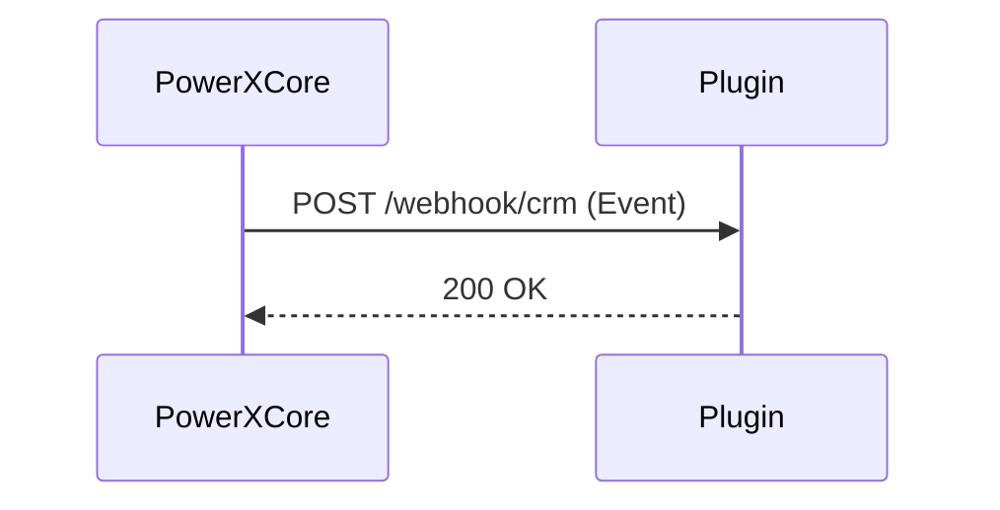

# Webhooks 与事件订阅规范（05_protocols_and_integrations/Webhooks_and_Event_Subscription.md）

> 本文档定义 PowerX 插件如何以安全、可靠的方式接收和消费来自宿主（PowerX Core）、  
> 其他插件（A2A）、以及第三方服务的事件（Event）。  
> 
> 涵盖注册流程、签名校验、重试与幂等机制，以及与 ToolGrant / Secrets 的联动机制。

---

## 🧭 一、设计目标

- 实现 PowerX 内外部事件系统的统一规范；
- 保障事件传递的安全性、可验证性、可追踪性；
- 支持租户隔离、多通道订阅（HTTP/gRPC/A2A）；
- 提供可靠投递、重试、幂等性机制；
- 可通过 Marketplace 审核与宿主事件中心集成。

---

## 🧱 二、事件模型（Event Envelope）

PowerX 所有事件都采用统一的 Envelope 格式：

```json
{
  "event_id": "evt_01F8ZK8D",
  "event_type": "crm.contact.created",
  "source": "powerx.crm",
  "target": "com.powerx.plugin.analytics",
  "tenant_id": "tenant_abc",
  "timestamp": "2025-10-13T12:30:00Z",
  "context": {
    "trace_id": "c94aab8a-1a9b-4d4b",
    "trigger": "user_action",
    "retries": 0
  },
  "payload": {
    "contact_id": "c_932",
    "name": "Alice",
    "email": "alice@demo.com"
  },
  "signature": {
    "alg": "HMAC-SHA256",
    "sig": "e1b9c13c6e2...",
    "key_id": "whsec_01ABC"
  }
}
````

### 字段说明

| 字段                 | 说明                                     |
| ------------------ | -------------------------------------- |
| `event_id`         | 全局唯一事件ID                               |
| `event_type`       | 事件类型（命名空间风格，如 `crm.contact.created`）   |
| `source`           | 事件发起方（PowerX Core / Plugin / External） |
| `target`           | 事件目标接收者                                |
| `tenant_id`        | 所属租户，保证隔离                              |
| `context.trace_id` | 追踪调用链                                  |
| `signature`        | 消息签名（由宿主生成，插件验证）                       |

---

## ⚙️ 三、插件侧事件注册

插件可在 manifest 中声明可监听的事件：

```yaml
events:
  inbound:
    - type: "crm.contact.created"
      target_path: "/webhook/crm"
      description: "当创建新联系人时触发"
    - type: "ai.email.sent"
      target_path: "/webhook/email"
  outbound:
    - type: "analytics.report.generated"
      description: "当生成报告后通知宿主"
```

宿主在安装时：

1. 在事件目录（Event Registry）注册这些订阅；
2. 分配签名密钥（Webhook Secret）；
3. 创建租户隔离的投递队列。

---

## 🔐 四、安全机制

### 1️⃣ 签名验证

宿主每次发送事件时都会附加签名头：

```
X-PowerX-Signature: t=1739400000,v1=e1b9c13c6e2...
X-PowerX-Event-ID: evt_01F8ZK8D
X-PowerX-Tenant: tenant_abc
```

插件需通过宿主下发的 `WEBHOOK_SECRET` 验证：

```go
func verifySignature(body []byte, signature, secret string) bool {
    mac := hmac.New(sha256.New, []byte(secret))
    mac.Write(body)
    expected := hex.EncodeToString(mac.Sum(nil))
    return hmac.Equal([]byte(signature), []byte(expected))
}
```

---

### 2️⃣ ToolGrant 集成

事件消费也受 ToolGrant 授权约束：

| 授权层             | 用途                         |
| --------------- | -------------------------- |
| **宿主 → 插件**     | 验证插件是否有订阅权限                |
| **插件 → 宿主（回调）** | 插件上报处理状态需要有效 ToolGrant     |
| **跨插件（A2A）**    | 使用 Envelope.auth.toolgrant |

---

## 🧩 五、事件投递与重试策略

### 投递流程



### 投递规范

| 规则     | 默认值                      | 说明      |
| ------ | ------------------------ | ------- |
| 超时时间   | 10 秒                     | 超时则重试   |
| 最大重试次数 | 5 次                      | 采用指数退避  |
| 重试间隔   | 2s → 4s → 8s → 16s → 32s | 最大 5 次  |
| 签名有效期  | 5 分钟                     | 超时无效    |
| 并发上限   | 5 并发                     | 每插件队列隔离 |

### 示例：宿主重试事件

```json
{
  "event": "event.retry",
  "event_id": "evt_01F8ZK8D",
  "retries": 3,
  "last_status": 500
}
```

---

## 🧠 六、幂等性与去重机制

插件应使用 `event_id` 进行幂等处理：

```go
if redis.Exists("evt:"+event.ID) {
    return // 已处理
}
redis.Set("evt:"+event.ID, 1, 24*time.Hour)
processEvent(event)
```

宿主保证同一事件不会同时多次发送，但插件仍应防御重复调用。

---

## 🧩 七、事件消费模式

| 模式                     | 通道                | 特点                     | 适用场景                |
| ---------------------- | ----------------- | ---------------------- | ------------------- |
| **Webhook (HTTP)**     | `POST /webhook/*` | 简单直接，适合 SaaS 插件        | CRM、Marketing、AI 报告 |
| **A2A Envelope**       | `/a2a/inbox`      | 统一智能体协议，带上下文           | Agent 协作            |
| **gRPC Stream**        | 双向流式              | 高吞吐事件流                 | 实时日志、监控类插件          |
| **MQ Bridge**          | NATS / Kafka（内部）  | 批量异步                   | 大型企业部署              |
| **Webhook → MCP Tool** | 转换层               | Webhook 数据转为 MCP Input | 智能自动化插件             |

---

## 🧾 八、出站事件（Outbound Events）

插件可以主动推送事件回宿主或其他插件：

```bash
POST /_p/com.powerx.plugin.crm/events
Content-Type: application/json
Authorization: Bearer <ToolGrant>

{
  "event_type": "crm.lead.converted",
  "payload": { "lead_id": "L123" },
  "context": { "trace_id": "..." }
}
```

宿主负责：

- 验签；
- 写入事件流；
- 广播到其他订阅插件。

---

## ⚙️ 九、事件类型命名规范

命名规则：

```
<domain>.<entity>.<action>
```

示例：

| 类别  | 示例                                          |
| --- | ------------------------------------------- |
| 系统  | `system.plugin.installed`                   |
| CRM | `crm.contact.created`, `crm.deal.closed`    |
| AI  | `ai.task.completed`, `ai.embedding.updated` |
| 营销  | `marketing.campaign.started`                |
| 自定义 | `custom.<namespace>.<event>`                |

---

## 🧩 十、事件日志与审计

宿主会自动记录以下事件日志：

| 日志类型             | 内容   |
| ---------------- | ---- |
| `event.sent`     | 投递成功 |
| `event.failed`   | 投递失败 |
| `event.retry`    | 重试事件 |
| `event.replayed` | 手动重播 |
| `event.revoked`  | 订阅撤销 |

插件可以通过宿主事件中心查询：

```
GET /api/v1/events?plugin_id=com.powerx.plugin.crm
```

---

## 🧩 十一、Webhook 安全最佳实践

| 检查项          | 要求                |
| ------------ | ----------------- |
| HTTPS 强制启用   | ✅                 |
| 验签必需         | ✅                 |
| 请求来源白名单      | PowerX 宿主域名       |
| 超时保护         | ≤ 10 秒            |
| 幂等性防重复       | ✅                 |
| 日志脱敏         | 不记录 Header / Body |
| 事件 TTL       | ≤ 5 分钟            |
| ToolGrant 校验 | ✅                 |
| 租户隔离         | ✅                 |

---

## 🧩 十二、自检清单（Webhook Ready Checklist）

| 检查项                              | 状态 |
| -------------------------------- | -- |
| manifest 中声明 inbound/outbound 事件 | ✅  |
| 宿主已分配 Webhook Secret             | ✅  |
| 插件实现签名校验逻辑                       | ✅  |
| 幂等处理逻辑已测试                        | ✅  |
| 出站事件携带 ToolGrant                 | ✅  |
| 订阅可在控制台测试                        | ✅  |
| 审计日志可查询                          | ✅  |

---

## 📚 十三、延伸阅读

- [ToolScopes_and_GrantMatrix.md](./ToolScopes_and_GrantMatrix.md)
- [External_API_and_Secrets_Integration.md](./External_API_and_Secrets_Integration.md)
- [Plugin_Security_Checklist.md](../04_security_and_compliance/Plugin_Security_Checklist.md)
- [Logs_Metrics_and_Tracing.md](../03_runtime_and_ops/Logs_Metrics_and_Tracing.md)

---

> **文档版本：** v1.1.0
> **适用范围：** PowerX ≥ 0.9.0
> **维护团队：** PowerX Protocol & Integration Team
> **最后更新：** 2025-10

```

---

✅ **总结：**

这一篇补全了整个「协议与集成」层的事件通信闭环：

- 定义了统一的 Event Envelope；
- 支持 HTTP / gRPC / A2A 多通道；
- 内置签名、ToolGrant、租户隔离；
- 提供重试、幂等、防重复、审计全链；
- 与上层的 `ToolGrant`、`A2A`、`Secrets` 模型协同一致。

