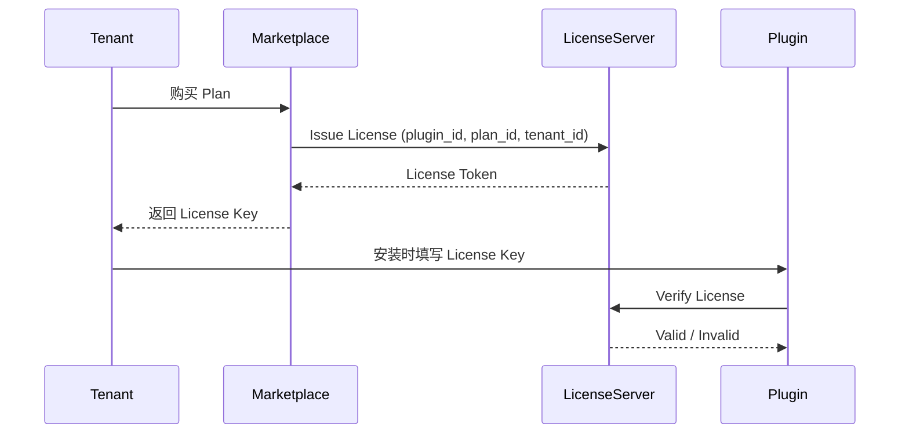

# 定价与授权规范（06_marketplace_and_business/Pricing_and_Licensing.md）

> 本文档定义 PowerX 插件在 Marketplace 上的 **价格计划（Pricing Plan）**、  
> **授权模型（License Model）**、**验证机制** 与 **分润逻辑**。  
>
> 它是 Marketplace 商业生态的核心协议，确保所有插件在合法、安全、可追踪的授权体系下运行。

---

## 🧭 一、设计目标

- 支持多种插件商业模式（免费、一次性购买、订阅、计量计费）；  
- 通过 License Server 管理授权生命周期（发放、验证、续期、吊销）；  
- 实现租户隔离与多实例授权；  
- 支持 Marketplace 自动分润与销售结算；  
- 兼容 SaaS 与 On-Prem 部署场景。

---

## 💡 二、核心对象关系图

```

┌───────────────────────┐
│   PowerX Marketplace  │
│  ├─ 定价策略           │
│  ├─ License Server    │
│  ├─ 计费与结算         │
│  └─ 审核与分润         │
└───────────────────────┘
│
▼
┌─────────────────────────────┐
│  Tenant / Organization      │
│  ├─ 购买 Plan               │
│  ├─ 激活 License            │
│  ├─ 绑定 Plugin 实例        │
│  └─ 周期续费 / 升级         │
└─────────────────────────────┘
│
▼
┌─────────────────────────────┐
│ PowerX Plugin Instance      │
│  ├─ 启动时校验 License      │
│  ├─ 上报使用数据            │
│  ├─ 接收续期事件            │
│  └─ 到期后自动停用          │
└─────────────────────────────┘

````

---

## 🧩 三、定价模型（Pricing Models）

PowerX Marketplace 支持四种主要定价模型：

| 模型 | 示例 | 特点 |
|------|------|------|
| **Free（免费）** | 0 元 / 永久 | 无需 License，仍可追踪安装量 |
| **One-Time（一次性购买）** | ¥999 / 永久 | 一次支付，永久授权 |
| **Subscription（订阅）** | ¥199/月 / ¥1999/年 | 按周期续费，自动续期 |
| **Usage-Based（按量计费）** | ¥0.01 / API 调用 | 通过 Usage Report 结算 |

> 插件可组合多种模型，例如「免费基础版 + 高级订阅版」。

---

## 🧾 四、定价配置示例（plugin.yaml）

```yaml
pricing:
  model: subscription
  plans:
    - id: basic
      name: "基础版"
      price: 199
      currency: "CNY"
      interval: "month"
      features:
        - "最多 1,000 条客户记录"
        - "不含 AI 自动化"
    - id: pro
      name: "专业版"
      price: 1999
      currency: "CNY"
      interval: "year"
      features:
        - "不限客户数量"
        - "包含 AI 邮件与任务自动化"
        - "专属支持"
  trial:
    enabled: true
    duration_days: 14
  usage:
    metric: "api.calls"
    price_per_unit: 0.01
````

Marketplace 会自动解析这些计划生成前端展示与结算选项。

---

## 🧮 五、License 模型（License Model）

License 是插件合法运行的核心凭证。
每个 License 都与「插件 + 租户 + Plan」绑定。

| 字段           | 说明                           |
| ------------ | ---------------------------- |
| `license_id` | 唯一标识符（UUID）                  |
| `plugin_id`  | 插件标识（com.powerx.plugin.crm）  |
| `tenant_id`  | 授权租户                         |
| `plan_id`    | 对应价格计划                       |
| `status`     | active / expired / suspended |
| `issued_at`  | 签发时间                         |
| `expires_at` | 到期时间                         |
| `signature`  | License Server 签名            |
| `features`   | 功能范围                         |
| `quota`      | 使用额度（如 API 次数、容量）            |

---

## ⚙️ 六、License 签发与验证流程

### 1️⃣ 签发阶段



### 2️⃣ License 格式（JWT 结构）

```json
{
  "license_id": "lic_12345",
  "plugin_id": "com.powerx.plugin.crm",
  "tenant_id": "tenant_abc",
  "plan_id": "pro",
  "issued_at": "2025-10-13T12:00:00Z",
  "expires_at": "2026-10-13T12:00:00Z",
  "signature": "ed25519:xxxx"
}
```

插件启动时通过 License SDK 验证签名与有效期。

---

## 🔐 七、License 校验与续期逻辑

### 插件启动时

1. 读取本地 License Key；
2. 向 License Server 发送验证请求；
3. 验证签名、时间戳、租户一致性；
4. 若验证失败 → 拒绝启动；
5. 若即将过期 → 触发自动续期。

### 验证接口

```bash
POST /api/v1/license/verify
{
  "plugin_id": "com.powerx.plugin.crm",
  "license_key": "<base64-encoded>"
}
```

响应：

```json
{
  "status": "valid",
  "plan": "pro",
  "expires_at": "2026-10-13T12:00:00Z"
}
```

---

## 🔄 八、License 续期与吊销

| 场景      | 触发方            | 行为                      |
| ------- | -------------- | ----------------------- |
| 到期前 7 天 | License Server | 自动续期请求                  |
| 支付失败    | Marketplace    | 暂停 License（`suspended`） |
| 手动取消订阅  | Tenant         | 立即失效                    |
| 安全违规    | Marketplace    | 强制吊销                    |

事件：

```json
{
  "event": "license.revoked",
  "license_id": "lic_12345",
  "reason": "payment_failed"
}
```

---

## 📊 九、使用上报（Usage Reporting）

插件需定期上报使用量至 License Server：

```bash
POST /api/v1/license/usage
{
  "license_id": "lic_12345",
  "metrics": {
    "api.calls": 42,
    "contacts.created": 10
  },
  "timestamp": "2025-10-13T12:00:00Z"
}
```

License Server 负责：

- 更新配额与用量；
- 触发计量计费；
- 将数据同步给 Marketplace 用于结算。

---

## 💰 十、收入与分润（Revenue Share）

| 项目        | 比例         | 说明              |
| --------- | ---------- | --------------- |
| Vendor 收入 | 80%        | 插件开发者分润         |
| PowerX 平台 | 15%        | 平台使用与分发         |
| 结算缓冲      | 5%         | 手续费、支付渠道成本      |
| 支付周期      | 月结（次月 5 日） | 自动打款到 Vendor 账户 |

---

## 🧾 十一、试用与降级策略

| 场景         | 行为            |
| ---------- | ------------- |
| Trial 结束   | 自动降级至 Free 计划 |
| 超出额度       | 停用部分功能并提示升级   |
| License 过期 | 插件进入「受限模式」    |
| 恢复支付       | 重新激活 License  |

---

## ⚙️ 十二、插件侧集成建议

PowerXPluginBase 可通过 License SDK 实现验证与上报：

```go
import "powerx.io/sdk/license"

func Startup() error {
  if !license.Verify() {
      return fmt.Errorf("invalid license")
  }
  license.ReportUsage(map[string]int{
      "api.calls": 1,
  })
  return nil
}
```

SDK 内部自动处理：

- 签名验证；
- 重试与缓存；
- License Server 回退模式（断网缓冲）。

---

## 🧠 十三、License Server 集成架构

```
┌────────────────────────────────────┐
│ PowerX License Server              │
│ ├─ /issue                          │
│ ├─ /verify                         │
│ ├─ /renew                          │
│ ├─ /usage                          │
│ ├─ /revoke                         │
│ └─ Webhook → Marketplace           │
└────────────────────────────────────┘
```

支持多环境部署：

- `license.powerx.cloud`（SaaS 版）
- `license.local.internal`（企业 On-Prem）

---

## 📈 十四、License 事件与审计

| 事件类型                     | 描述           |
| ------------------------ | ------------ |
| `license.issued`         | 新 License 签发 |
| `license.renewed`        | License 续期   |
| `license.revoked`        | License 吊销   |
| `license.expired`        | License 到期   |
| `license.violated`       | 插件违规调用       |
| `license.usage.reported` | 使用量上报        |

所有事件都会写入 Audit Stream 与 Marketplace 报表。

---

## 🧩 十五、自检清单（License Ready Checklist）

| 检查项                          | 状态 |
| ---------------------------- | -- |
| plugin.yaml 定义 pricing.plan  | ✅  |
| manifest 含 license_server 配置 | ✅  |
| 插件可校验 License Key            | ✅  |
| 定期上报 Usage                   | ✅  |
| License 事件可追踪                | ✅  |
| License 异常可处理（挂起/续期）         | ✅  |
| Vendor 分润账户已绑定               | ✅  |

---

## 📚 十六、延伸阅读

- [Listing_and_Branding_Guide.md](./Listing_and_Branding_Guide.md)
- [Usage_Analytics_and_Reports.md](./Usage_Analytics_and_Reports.md)
- [Revenue_Share_and_Payouts.md](../05_finance_and_settlement/Revenue_Share_and_Payouts.md)
- [License_API_and_Verification.md](../05_finance_and_settlement/License_API_and_Verification.md)

---

> **文档版本：** v1.1.0
> **适用范围：** PowerX ≥ 0.9.0
> **维护团队：** PowerX Marketplace & Licensing Team
> **最后更新：** 2025-10
